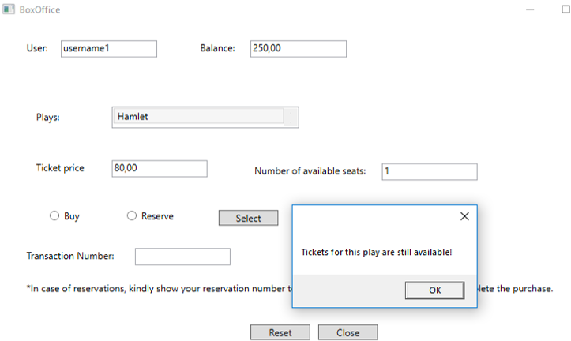

# TheatreDatabase 

A Databases Course project.

## Description

Represents a simulation of a theatre box office. 
Access to the box offices requires successful login.
Users can choose between purchasing a ticket and making a reservation.
Changes made to the account balance and number of available seats are handled using stored procedures.

## Technologies 

RDBMS: MS SQL Server
IDE: Visual Studio 2017
Programming language: C#
ORM: Entity Framework 6.0
GUI: WPF

### Demo

